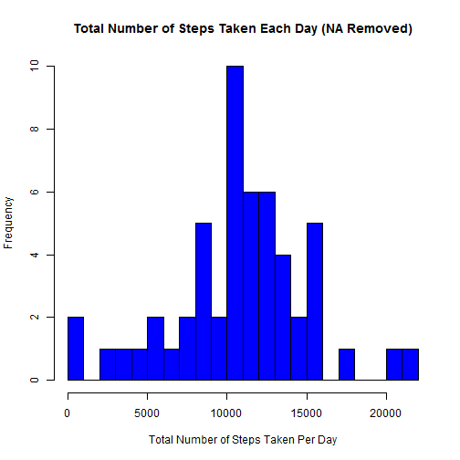
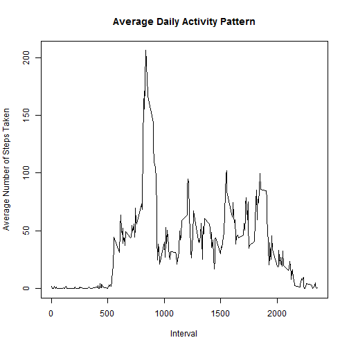
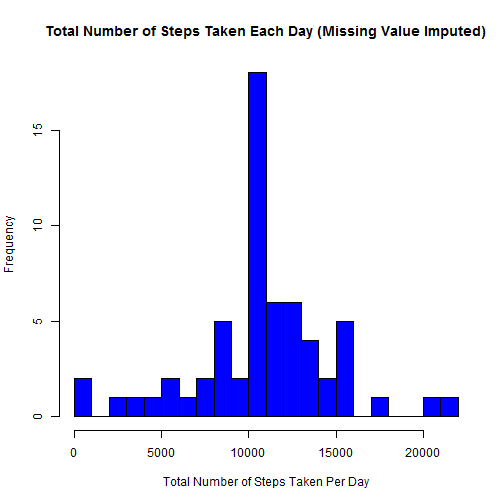
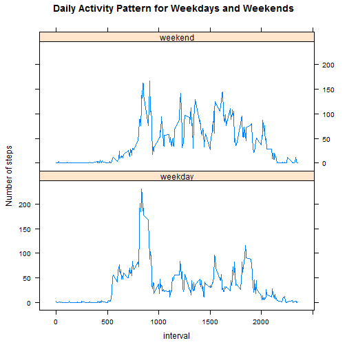

# Set working directory for the analysis

```r
knitr::opts_knit$set(root.dir = 'C:/Users/xyu/Desktop/Work/R Programming/Course/5 Reproducible Research/Week 2/project')
```

# Loading and examing the data

```r
data <- read.csv("activity.csv", colClasses = c(steps = "character", date = "Date", interval = "numeric"))
head(data)
```

```
##   steps       date interval
## 1  <NA> 2012-10-01        0
## 2  <NA> 2012-10-01        5
## 3  <NA> 2012-10-01       10
## 4  <NA> 2012-10-01       15
## 5  <NA> 2012-10-01       20
## 6  <NA> 2012-10-01       25
```

# What is mean total number of steps taken per day?

```r
#subset a dataset that doesn't contain the missing value.
data1 <- data[!is.na(data$steps),]
head(data1)
```

```
##     steps       date interval
## 289     0 2012-10-02        0
## 290     0 2012-10-02        5
## 291     0 2012-10-02       10
## 292     0 2012-10-02       15
## 293     0 2012-10-02       20
## 294     0 2012-10-02       25
```

```r
#calculate the total number of steps taken per day.
totalstep <- sapply(split(as.numeric(data1$steps), as.factor(data1$date)), sum)

#make a data frame with the date and the total number of steps taken per day.
df <- data.frame(date = as.Date(unique(data1$date)), frq = totalstep)
#plot a histogram of the total number of steps taken each day.
hist(df$frq, breaks = 20, col = "blue", xlab = "Total Number of Steps Taken Per Day", ylab = "Frequency",  main = "Total Number of Steps Taken Each Day (NA Removed)")
```



```r
#calculate the mean and median of the total number of steps taken per day.
mean(df$frq)
```

```
## [1] 10766.19
```

```r
median(df$frq)
```

```
## [1] 10765
```

# What is the average daily activity pattern?

```r
#calculate the average number of steps taken across all days.
a <- aggregate(as.numeric(data1$steps) ~ data1$interval, data = data1, mean)
names(a) <- c("interval", "avestep")
#make the time series plot of the interval and the average number of steps taken across all days.
plot(a$interval, a$avestep, type = "l", xlab = "Interval", ylab = "Average Number of Steps Taken", main = "Average Daily Activity Pattern")
```



```r
#store the max average number of steps taken across all days in b.
b <- max(a$avestep)
#return the 5-minute interval that contains the maximum number of steps.
a[a$avestep == b, 1]
```

```
## [1] 835
```

# Imputing missing values.

```r
#subset a dataset that only contains the missing value NA.
data2 <- data[is.na(data$steps),]
#return the total number of missing values in the dataset.
nrow(data2)
```

```
## [1] 2304
```

```r
#fill in the missing values with the mean for that 5-minute interval which came from last step.
c <- merge(data2, a, by.x = "interval", by.y = "interval", all = T)
c <- c[, c(1,3,4)]
library(dplyr)
c <- rename(c, steps = avestep)

#create a new data with the missing data filled in.
data3 <- rbind(c, data1)
data3 <- data3[, c(3,2,1)]

#calculate the total number of steps taken per day.
totalstep3 <- sapply(split(as.numeric(data3$steps), as.factor(data3$date)), sum)
#make a data frame with the date and the total number of steps taken per day.
df3 <- data.frame(date = as.Date(unique(data3$date)), frq = totalstep3)
#plot a histogram of the total number of steps taken each day.
hist(df3$frq, breaks = 20, col = "blue", xlab = "Total Number of Steps Taken Per Day", ylab = "Frequency",  main = "Total Number of Steps Taken Each Day (Missing Value Imputed)")
```



```r
#calculate the mean and median of the total number of steps taken per day.
mean(df3$frq)
```

```
## [1] 10766.19
```

```r
median(df3$frq)
```

```
## [1] 10766.19
```
The mean stays same, but the median is slightly higher after imputing the missing data. Imputing missing data made the estimates of the total daily number of steps larger.

# Are there differences in activity patterns between weekdays and weekends?

```r
#create a new factor variable "flag" to indicate a date is a weekday or weekend.
data3$day <- weekdays(data3$date, abbreviate = F)
data3$flag <- as.factor(ifelse(weekdays(data3$date) == "Saturday" | weekdays(data3$date) == "Sunday", "weekend", "weekday"))

#make a panel plot.
weekday <- data3[data3$flag == "weekday",]
weekend <- data3[data3$flag == "weekend",]
d_weekday <- aggregate(as.numeric(weekday$steps) ~ weekday$interval, data = weekday, mean)
d_weekend <- aggregate(as.numeric(weekend$steps) ~ weekend$interval, data = weekend, mean)
names(d_weekday) <- c("interval", "avesteps")
names(d_weekend) <- c("interval", "avesteps")
d_weekday$day <- "weekday"
d_weekend$day <- "weekend"
e <- rbind(d_weekday, d_weekend)
library(lattice)
xyplot(avesteps ~ interval | day, data = e, layout = c(1,2), type = "l", ylab = "Number of steps", main = "Daily Activity Pattern for Weekdays and Weekends")
```


